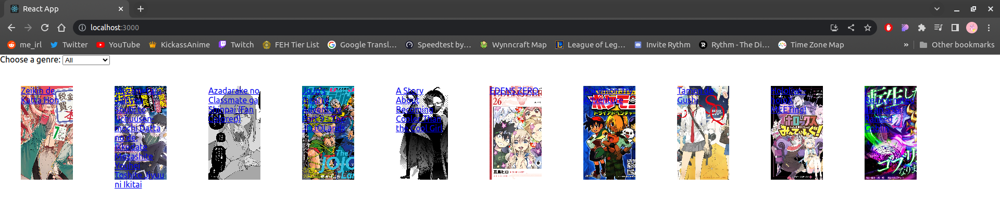
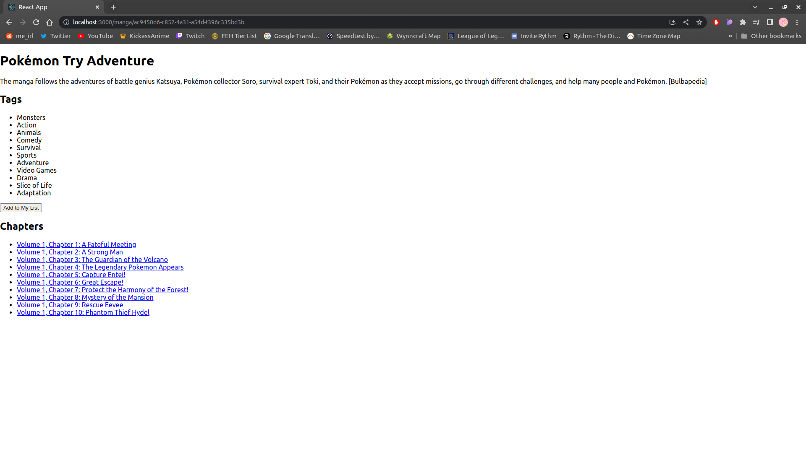
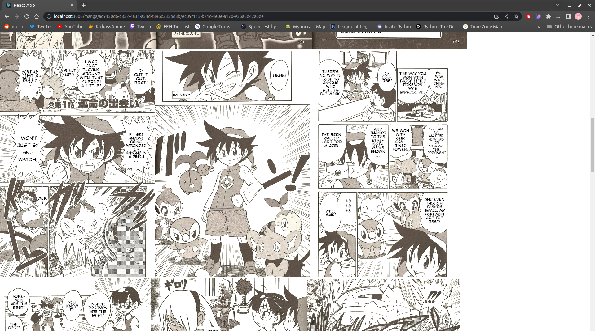

# Web Application Development Evidence<a name="web-application-development-evidence"></a>

---

- [Web Application Development Evidence](#web-application-development-evidence)
  - [Introduction](#introduction)
    - [User-Friendly](#user-friendly)
    - [Full-Stack](#full-stack)
  - [Understanding Full Stack Development](#understanding-full-stack-development)
  - [What does learning "full-stack development" imply?](#what-does-learning-full-stack-development-imply)
  - [Achievements](#achievements)
    - [Backend Achievements](#backend-achievements)
      - [In-depth Overview](#in-depth-overview)
        - [Manga API](#manga-api)
        - [User API](#user-api)
    - [Frontend Achievements](#frontend-achievements)
      - [In-depth Overview](#in-depth-overview)
  - [Links to Repositories](#links-to-repositories)


## Introduction<a name="introduction"></a>

### User-Friendly<a name="user-friendly"></a>

*Employment of best practices for crafting user interfaces, and utilization of fundamental user experience testing and development methodologies.*

### Full-Stack<a name="full-stack"></a>

*Design and construction of a full-stack application with a widely recognized front-end JavaScript framework, along with a backend application implementing the essential communication protocols, data persistence using ORM, and addressing the issues of asynchronous communication.*

## Understanding Full Stack Development<a name="understanding-full-stack-development)"></a>

Full stack development entails the comprehensive cycle of designing, building, testing, and deploying a complete web application. This process works in sync with a wide range of technologies and tools, covering both front-end and back-end web development aspects, in addition to database development. Essentially, full-stack development refers to the competency of a software engineer or developer to work with both front and back-end of a website or application, enabling a cohesive flow from user interaction to backend processing.

## What does learning "full-stack development" imply?<a name="what-does-learning-full-stack-development-imply"></a>

Learning full-stack development embodies the ability to gain a holistic understanding and skills in both front-end and back-end technologies. This proficiency spans across mastering front-end languages like HTML, CSS, and JavaScript, along with prevalent JavaScript frameworks such as React. It also includes back-end competencies in server-side programming languages, including Python, Java, or Node.js, and frameworks like Django or Express.js. Essential skills in database management systems, RESTful APIs, integration of distinct components, and understanding deployment strategies are also key aspects. The goal is to develop the capability to autonomously build, deploy, and maintain web applications that integrate user interfaces, server-side logic, and data storage.

## Achievements<a name="achievements"></a>

My achievements will be divided into two main sections: [Backend Achievements](#backend-achievements) and [Frontend Achievements](#frontend-achievements).

### Backend Achievements<a name="backend-achievements"></a>

In my journey of full-stack development, the backend development milestones have been especially rewarding. One of the key accomplishments in this area was the successful implementation of a microservices architecture. By employing this approach, I was able to decompose a monolithic application into smaller, independent services, which significantly enhanced the scalability, flexibility, and maintainability of the system.

In addition, I made use of cutting-edge containerization technologies, specifically Docker. Using Docker, I containerized each microservice, which facilitated consistent deployment across varying environments and ensured effective scaling and resource utilization. This strategy greatly simplified the deployment and management of backend components, while ensuring isolation, portability, and a convenient development environment.

```yaml
# Docker Compose file for microservices architecture
version: '3'
services:
  db:
    container_name: mangamonkey-db
    image: mysql
    restart: always
    environment:
      MYSQL_ROOT_PASSWORD: manga_root
      MYSQL_DATABASE: mangamonkey

  client:
    container_name: mangamonkey
    build: ./frontend
    volumes:
      - ./frontend:/usr/src/app
    ports:
      - "3000:3000"
    restart: always

  server:
    container_name: mangamonkey_manga
    build: ./manga
    volumes:
      - ./manga:/usr/src/app
    ports:
      - "5000:5000"
    restart: always

  users:
    container_name: mangamonkey_users
    build: ./user
    env_file:
      - ./user/.env
    volumes:
      - ./user:/usr/src/app
    ports:
      - "5001:5001"
    restart: always
```

### In-depth Overview<a name="in-depth-overview"></a>

#### Manga API<a name="manga-api"></a>

For the Manga API, I used Node.js and Express.js and the Axios library to fetch data from an external manga API. The application retrieves a list of manga, along with the cover image and genres, which are then formatted and sent as a response, providing a simplified yet valuable data source for the client.

```javascript
const express = require('express')
const axios = require('axios')
const router = express.Router()

router.get("/", async (req, res) => {
    let finalResponse = {
        mangas: [],
        
    }
    const response = await axios.get(`https://api.mangadex.org/manga?limit=10&includedTagsMode=AND&excludedTagsMode=OR&contentRating%5B%5D=safe&contentRating%5B%5D=suggestive&order%5BlatestUploadedChapter%5D=desc&includes%5B%5D=manga&includes%5B%5D=cover_art`) //10 manga
    finalResponse.mangas = []
    response.data.data.forEach(manga => {
        console.log(JSON.stringify(manga.relationships[2]))
        const coverimage = manga.relationships.find(el => el.type === "cover_art")
        const genres = manga.attributes.tags.filter(tag => tag.attributes.group === 'genre').map(tag => tag.attributes.name.en)
        finalResponse.mangas.push({
            coverLink: `https://uploads.mangadex.org/covers/${manga.id}/${coverimage.attributes.fileName}`,
            title: manga.attributes.title.en,
            id: manga.id,
            genres: genres
        });
    })
    res.send(finalResponse)
})


module.exports = router
```

#### User API<a name="user-api"></a>

The Users microservice manages user data. The Users microservice interfaces well with the User model and the manga list.

```javascript
const express = require('express');
const app = express();
const Users = require('./models/Users');
const MangaList = require('./models/MangaList');
const userRoutes = require('./routes/userRoutes');
const mangalistRoutes = require('./routes/mangalistRoutes');
const cors = require('cors');

app.use(cors());
app.use(express.json());

Users.sync();
MangaList.sync();

app.use('/user', userRoutes);
app.use('/mangalist', mangalistRoutes);

app.get('/', (req, res) => {
    res.send('Hello World!');
});

const PORT = process.env.PORT || 5001;

app.listen(PORT, () => console.log(`Server running on port ${PORT}`));
```

### Frontend Achievements<a name="frontend-achievements"></a>

On the front-end side, I worked with React, a popular JavaScript library for building user interfaces. My application allows users to browse through the first 10 chapters of a selected manga, making for an engaging reading experience. Users can also add manga to their reading list, contributing to the app's interactivity and personalization. 





To conclude, my achievements showcase a strong grasp of full-stack development. From designing and building an application's architecture to implementing user-facing features, I have demonstrated proficiency in the full stack. The resulting application presents a user-friendly interface and a robust backend system that integrates modern technologies such as Docker and microservices.

## Links to Repositories<a name="links-to-repositories"></a>

Below are the links to the GitHub repositories that contain the source code for the projects detailed in this document:

- [Manga API (backend)](https://github.com/S3DB02/mangamonkey-manga-ap)
- [Users API (backend)](https://github.com/S3DB02/mangamonkey-user-api)
- [Manga Monkey (frontend)](https://github.com/S3DB02/mangamonkey-frontend)
