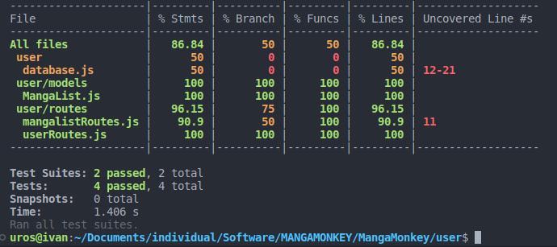
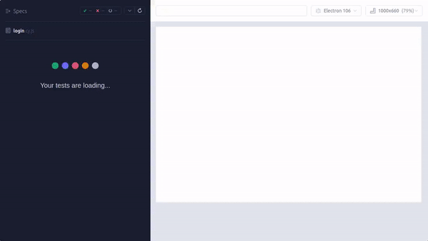
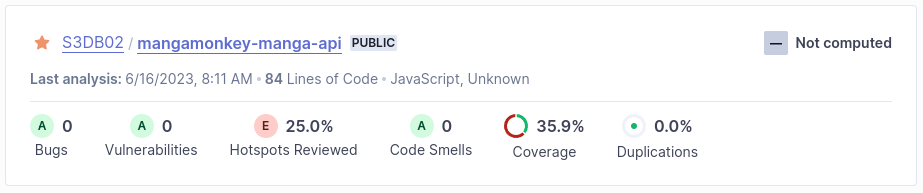

# Code quality 

- [Code quality](#code-quality)
  - [Intro](#intro)
  - [Tooling and methodology](#tooling-and-methodology)
  - [How is code quality measured?](#how-is-code-quality-measured)
  - [How do I measure my code quality?](#how-do-i-measure-my-code-quality)
  - [Automated code quality checking](#automated-code-quality-checking)
    - [Backend Testing with Jest](#backend-testing-with-jest)
    - [End-to-End testing with Cypress](#end-to-end-testing-with-cypress)
    - [Static code analysis with SonarCloud](#static-code-analysis-with-sonarcloud)

---

## Intro 

*Software tooling and methodologies are utilized to continuously monitor and enhance software quality throughout the software development process.*

## Tooling and methodology 

*Execute, monitor, and report on unit integration, regression, and system tests, paying attention to security and performance aspects. Static code analysis and code reviews are also applied.*

## How is code quality measured? 

Code quality is a blend of objective and subjective evaluations. It can be assessed by machines for standard noncompliance, security risks, code duplications, and also by human inspection for so-called "code smells". Both machine and human analyses are vital and complement each other during code analysis.

## How do I measure my code quality?

Peer review and static code analysis are my primary methods for evaluating code quality. If potential areas for refactoring are identified, I typically consult with peers and colleagues before taking action. However, if minor adjustments are detected by static analysis tools, I take the initiative to make the necessary improvements.

Continuous reassurance that a piece of code functions as expected is critical for ongoing development. Manual tests and frequent peer reviews can be time-consuming and tiresome. This is where tests come into play. They ensure that your code behaves as expected, regardless of the data, circumstances, or environment.

## Automated code quality checking

In my project, I implemented three different ways of quality assurance: [Backend Testing with Jest](#backend-testing-with-jest), [End-to-End testing with Cypress](#end-to-end-testing-with-cypress), and [Static code analysis with SonarCloud](#static-code-analysis-with-sonarcloud)

### Backend Testing with Jest

Jest is a JavaScript testing framework that allows you to ensure your JavaScript code is working as expected. It's used for unit and integration testing, and it's a great way to validate your code is working properly. I used Jest for my backend testing, specifically for the user microservice. Here's an example of the testing output:

### End-to-End testing with Cypress

End-to-end testing is crucial for ensuring that your application is working properly from start to finish. It tests your application in a way that mimics real user behavior, ensuring that all parts of your application are working together properly. I used Cypress for my end-to-end testing on the frontend. Here's an example of a test case:

### Static code analysis with SonarCloud

SonarCloud is a cloud service offered by SonarSource for performing automatic reviews with static analysis of code to detect bugs, code smells and security vulnerabilities. In my project, SonarCloud was used to analyze the codebase and provide insights about the code quality.

