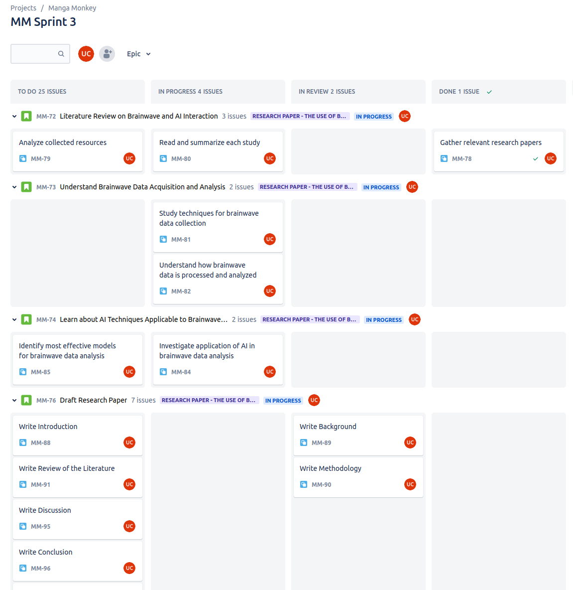
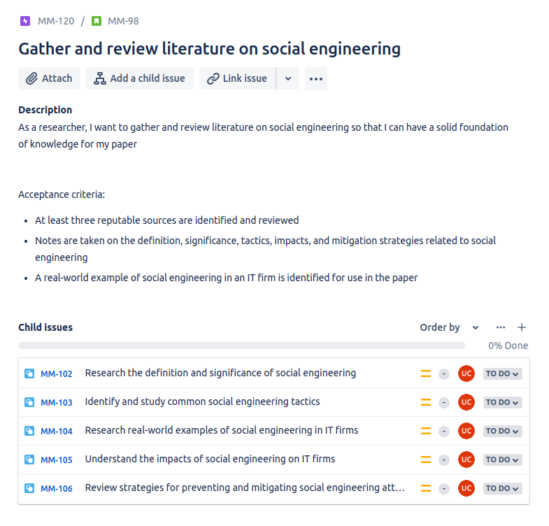
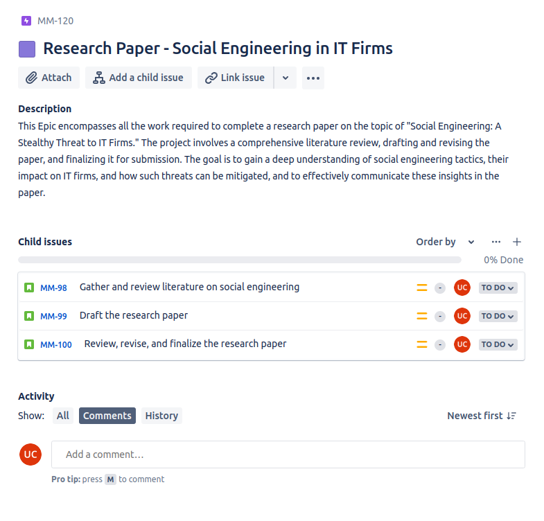
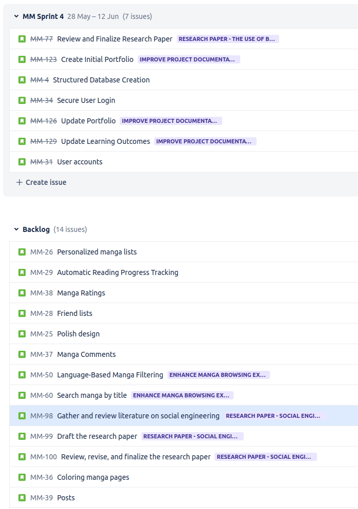

# Proof of Learning Outcome: Agile Method

- [Introduction](#introduction)
- [What is Agile?](#what-is-agile)
- [Tooling](#tooling)
- [Implementation in Group Project (GP)](#implementation-in-group-project-gp)
  - [Weekly Standups](#weekly-standups)
  - [Sprint Duration](#sprint-duration)
  - [Sprint Reflections](#sprint-reflections)
  - [Sprint Kick-off](#sprint-kick-off)
  - [Sprint Points System](#sprint-points-system)
- [Implementation in Individual Project (IP)](#implementation-in-individual-project-ip)
  - [Detailed Sprint Planning](#detailed-sprint-planning)
- [Conclusion](#conclusion)

## Introduction

As part of my studies in software development, I have gained substantial experience in the implementation of Agile methods during the course of my projects. I have used these methods in both group and individual projects to manage work effectively and deliver results in a timely manner.

## What is Agile?

Agile is a project management and product development approach that emphasizes flexibility, collaboration, customer satisfaction, and high-quality deliverables. It promotes adaptive planning, continuous improvement, and encourages rapid and flexible responses to change.

## Tooling

In both the group and individual projects, Jira played a pivotal role as a project management tool. It facilitated the Agile methodologies we adopted, allowing us to track tasks, manage sprints, and monitor the team's progress effectively.

## Implementation in Group Project (GP)

In the group project, my team was tasked by IO Digital to develop a solution which eventually became TrackiO. We adopted an Agile approach to manage the project effectively.

### Weekly Standups

To ensure constant communication and rapid problem-solving, we had weekly standups with our Product Owners (POs) from IO Digital. These meetings were essential for aligning the team with the project's goals, discussing the progress, addressing any blockers, and planning for the next steps.

### Sprint Duration

Our project was divided into sprints of three weeks each. This timeframe allowed us to plan, execute, and review our work in manageable chunks, enabling us to maintain high-quality standards while adapting to any changes or challenges that arose during the project.

### Sprint Review

At the end of each sprint, we conducted a sprint reflection with our stakeholders. These sessions gave us the opportunity to look back at the work done during the sprint, discuss what went well and what could be improved, and make plans for improvements in the next sprint.

### Sprint Kick-off

Before the start of each sprint, we had a meeting with the PO and tech support to discuss what we were planning on doing in the upcoming sprint. These kickoff meetings helped set clear expectations for the sprint and ensure all team members were on the same page.

### Sprint Points System

In the last two sprints of the project, we started using the sprint points system. This tool helped us to estimate the amount of work involved in each task and manage our workload more effectively. 

## Implementation in Individual Project (IP)

For my individual project, I adopted a structured and meticulous approach using the Agile methodology. I leveraged Jira, a popular project management tool often used in Agile projects, as my daily guide to monitor my progress and manage my tasks efficiently. The entire process was characterized by thorough planning, consistent tracking, and continuous improvement.

### Detailed Sprint Planning and Task Management

Before each sprint commenced, I planned my activities in detail to ensure maximum productivity and efficiency. A key rule of thumb I adopted was to handle 3-4 tasks per day. This ensured that my daily tasks were manageable, attainable, and could be realistically completed within a day.

In addition to planning, I was very meticulous with task management. I moved each task individually, which helped me keep track of my progress in a detailed manner. Furthermore, I made use of the sub-task grouping feature in Jira. This enhanced my organizational efficiency, allowing me to understand where I stood in terms of task completion at any given point.

### User Stories and Epics

An essential aspect of my project was the creation of effective user stories. Each user story was designed with a clear purpose in mind, and contained both the actual user story and acceptance criteria. This made my project requirements explicit, simplified, and easy to follow.

A good example of such a user story is one related to research I had planned - "Gather and review literature on social engineering". Here are the details:

This user story was divided into five distinct tasks for easier tracking and better focus. Moreover, it was a part of a larger epic titled "Research Paper - Social Engineering in IT Firms". By structuring my work into user stories and epics, I could maintain a clear vision of my project goals and how each task contributed to the overall objective.

### Backlog Management

One critical component of my project was the creation of a well-structured backlog. The aim was to design it such that it would be easy to understand for anyone wanting to take over the project or contribute in any way. This approach not only made the project easily transferable but also demonstrated the potential scope of the project. A stacked backlog, which I will illustrate with an image, serves as a testament to this.

## Conclusion

Implementing Agile methods in both group and individual projects has not only helped me deliver projects on time but also fostered a continuous learning and self-organizing environment. By maintaining a clear focus on my daily tasks, meticulously writing user stories, managing a comprehensive backlog, and meticulously tracking and organizing my tasks, I have deepened my understanding of Agile methods. This has allowed me to select and implement the most suitable methodology based on the project context, thereby improving my project management skills and boosting my productivity.

